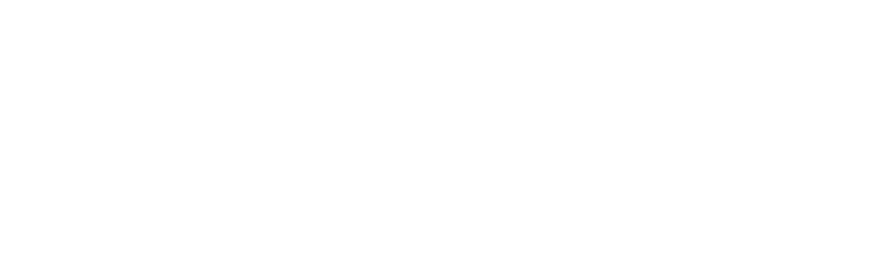

# IPP project 2022/23

## parse.php
This script reads IPPcode23 code from the standard input, checks its lexical and syntactic correctness and prints its XML representation to the standard output according to the assinged specification.

### Run
> parse.php < [IPPCODE23] > [OUTPUT.xml]

### Help
parse.php --help

## interpret.py 
This interpreter reads the XML representation of the IPPCode23 code from the file given by the --source parameter.

### Run
> interpret.py [-h] [--source SOURCE] [--input INPUT]\
> -h, --help       show this help message and exit\
> --source SOURCE  File with XML representation of source code\
> --input INPUT    File with inputs for interpretation of source code\

### Program flow
Interpret.py first of all parses the parameters given from the command line and creates a brief help for them (see the previous block titled Run). Then, using the *xml.etree.ElementTree* library, it sequentially loads individual XML elements, checks their semantic correctness, and creates new instances of the *instructions* and *arguments* classes

### Object design
This implementation uses only three classes, which turned out to be a quite suboptimal solution. These classes are *instruction*, *argument* and *variable*. All of them use the protected Python convention.

#### Class instruction
- order - the order in which instructions are executed
- opcode - identifies what the instruction represents
- args[] - an array of up to three arguments for the instruction
- get_type(), get_value() - getters to get values from an object

#### class argument
- arg_type
- value
- set_type(), set_value()
- get_type(), get_value()

#### class variable
- name
- var_type
- value
- set_type(), set_value()
    - setter for name is not needed, because the variable name is added only when the variable is initialized and never changes
- get_name(), get_type(), get_value()

### Functions
Since this implementation doesn't take the full advantage of the object oriented approach, it uses a large number of functions. The most important are:
- interpreter - a finite state machine for interpreting commands, calls the function interpreter_XY, where XY is the name of the command. This is a nice example of code which would be better OO. 
- add_arg2ins - adds all arguments to the instruction, probably should have been a class method of *instruction*